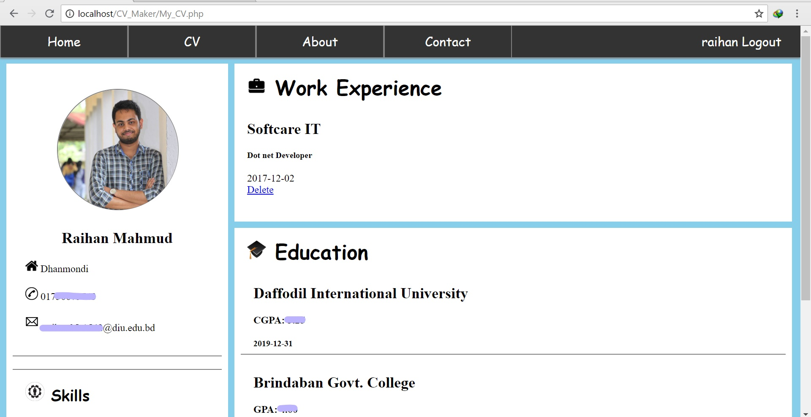

# CV-Maker

   
  
  
  
  

## Project Overview
User entry her information and system automatically generate CV.

## Technologies

- Front end: HTML, CSS
- Back end: PHP
- Database: MySQL

## About the Author

### Raihan Mahmud

- Facebook Page - [Raihan Mahmud RAM](https://www.facebook.com/raihanmahmudofficial)
- Facebook - [Raihan Mahmud RAM](https://www.facebook.com/raihanM95)
- Twitter - [Raihan Mahmud RAM](https://twitter.com/raihanM95)
- Linkedin - [Raihan Mahmud RAM](https://www.linkedin.com/in/raihanM95)

## Licensing

raihanM95/CV-Maker Project is licensed with the [Apache License](https://github.com/raihanM95/CV-Maker/blob/master/LICENSE).
